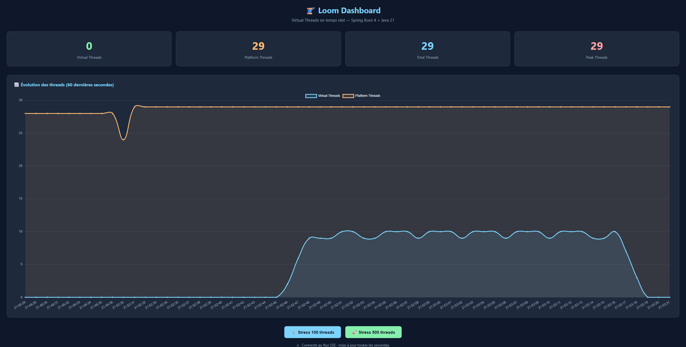
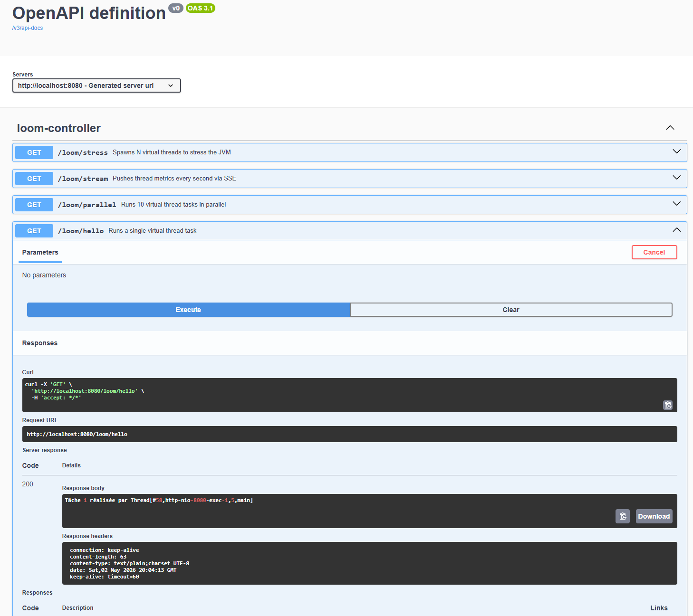

# loom-spring-playground
Exploring Java virtual threads with Spring Boot and Project Loom.

## Tech Stack

| Technology        | Version             |
|-------------------|---------------------|
| Java              | 21                  |
| Maven             | 3.8.6               |
| Spring Boot       | 4.0.6               |
| Project Loom      | Built-in (Java 21+) |
| springdoc-openapi | 2.8.8               |
| Chart.js          | Latest              |

## Metrics

Create a dashboard.html file in src/main/resources/static/, or use the one already provided in the repository.  
Run the Spring Boot application.  
Then open http://localhost:8080/dashboard.html in your browser.  

The dashboard displays the following metrics in real time :
- Virtual Threads : Lightweight threads managed by the JVM, the core of Project Loom ;
- Platform Threads : Traditional OS-level threads, heavy and limited in number ;
- Total Threads : Sum of virtual and platform threads currently running ;
- Peak Threads : Maximum number of threads reached since the application started.

### Dashboard example without stress

### Dashboard example with stress

### Optional

You can tweak the following values in application.properties:
- **loom.thread.create.tempo**: delay (in ms) between each thread creation ;
- **loom.thread.life.tempo**: delay (in ms) for how long each thread stays alive ;

## Endpoints

### Definition

| Method | Endpoint                 | Description                                |
|--------|--------------------------|--------------------------------------------|
| GET    | `/loom/hello`            | Runs a single virtual thread task          |
| GET    | `/loom/parallel`         | Runs 10 virtual thread tasks in parallel   |
| GET    | `/loom/stream`           | Pushes thread metrics every second via SSE |
| GET    | `/loom/stress?count=100` | Spawns N virtual threads to stress the JVM |

### Swagger

Swagger UI is available at http://localhost:8080/swagger-ui.html once the application is running.  

### Postman example
